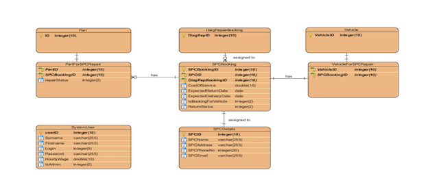
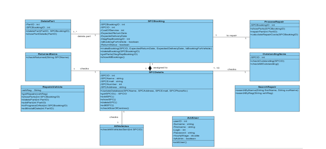
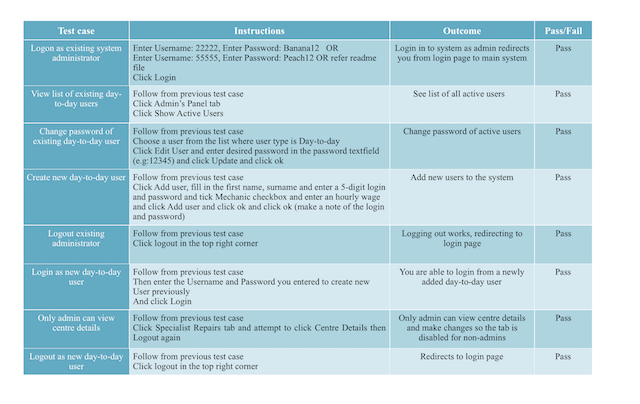

# GarageSystem
Stand-alone Java based implementation of a “Garage Management Information System (GM-SIS)”.
The requirements were organised into: Functional requirements, Data requirements and Non-functional requirements.
The requirements were designed in such a way that we had to apply solid object-oriented design principles in order to complete the project successfully.
## Database design

## Relationships design

## Test cases

